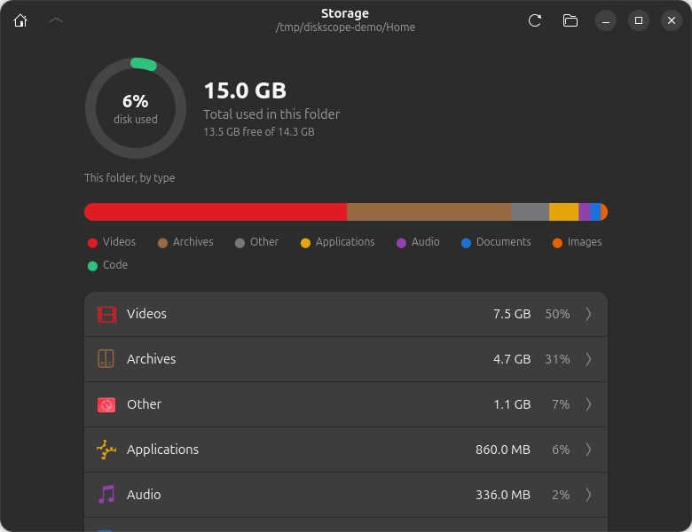
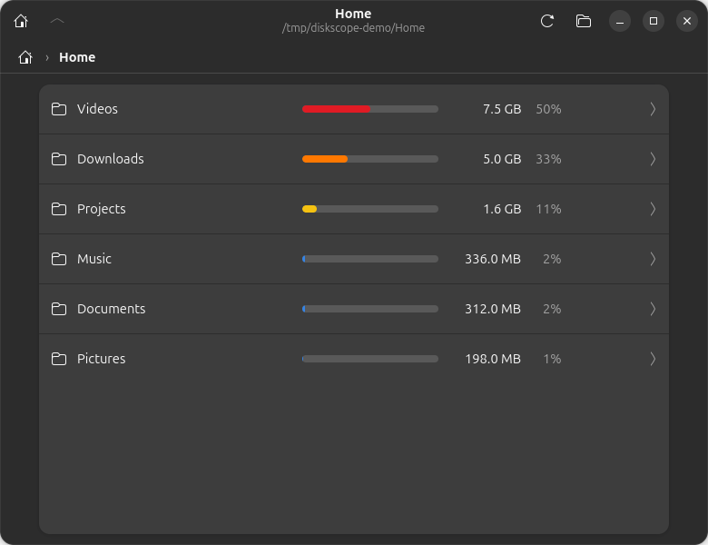
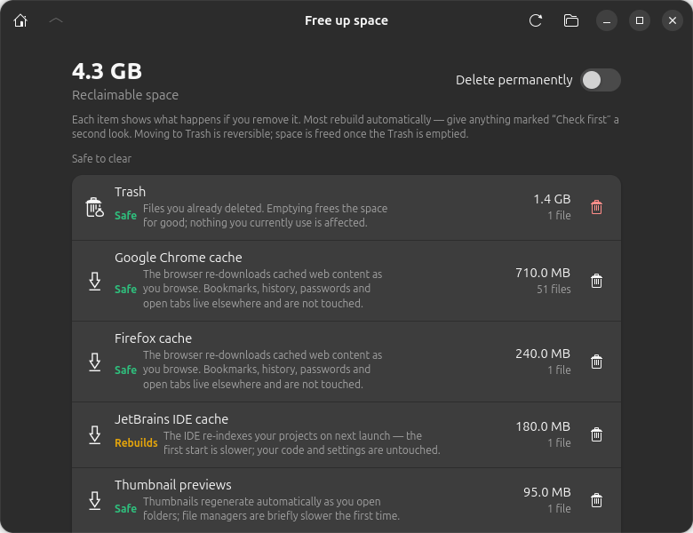

# DiskScope

A clean, native disk-usage analyzer for the GNOME desktop. Point it at a
folder and see — at a glance — what's eating your space, then drill in.

Built with **Rust + GTK4 + libadwaita**.


## Screenshots

<p align="center">
  
</p>

| Browse folders (heat-mapped tree) | Free up space (with blast radius) |
| :---: | :---: |
|  |  |

> Screenshots use a synthetic demo folder — no real files.

## What it does

Open it and you land on a **storage overview** (think Android's Storage
screen): a **disk capacity ring** (used vs. free of the whole filesystem,
green → amber → red as it fills), a **segmented usage bar** with a colour
**legend**, and a list of categories — Videos, Audio, Images, Documents,
Archives, Code, Applications, Other — each with its size and share of the
total. It scans your home directory by default.

From there you can:

- **Tap a category** to see its largest files and act on them.
- **Browse all folders** to drill the directory tree, where each entry shows a
  **colour-coded heat bar** (red = space hog → blue = small), size, and
  percentage of its parent. Click folders to drill in; use the breadcrumb or up
  button to climb out.
- **Act on what you find**: open any entry in your file manager, or move it to
  the Trash (with a confirmation) — DiskScope rescans automatically to show the
  space you freed.
- **Free up space** — a one-tap view of what's safe to clear *without losing
  important files*: your **Trash**, your **app caches**, and regenerable
  **project artifacts** found in the scanned tree (`node_modules`, Rust
  `target/`, `__pycache__`, …). Caches are broken out **per application** (with
  friendly names) — never offered as one giant "delete all of `~/.cache`" item,
  so you decide app by app. Every entry shows its **blast radius — what breaks if
  you delete it**: a colour-coded risk badge (**Safe** / **Rebuilds** / **Check
  first**) and a plain sentence on the consequence — e.g. a browser cache is
  *"Safe — re-downloads cached pages; bookmarks, history and logins live elsewhere
  and aren't touched,"* `node_modules` is *"Rebuilds — won't build until you
  reinstall (needs internet),"* and an unrecognised cache is flagged *"Check
  first."* The same assessment is repeated in the confirmation before anything is
  removed. Clearing **moves to Trash by default** (reversible); flip the **Delete
  permanently** switch — or use an item's right-click menu — to remove it for good
  and reclaim the space immediately.
- **Refresh** to rescan, or open a different folder entirely.

Categories are inferred from file extensions. Symlinks are never followed and
hardlinked files are counted only once, so nothing is double-counted. Generic
build-dir names (`target`, `build`, `dist`) are only flagged when a marker file
(`Cargo.toml`, `package.json`) proves they belong to a known tool, so a folder
you happen to call "build" is never mistaken for junk. No database, no settings,
no daemon (YAGNI) — just answer "where did my space go?" and let you fix it.

## Architecture

A two-crate workspace splits the pure logic from the GUI:

| Path | Role |
|------|------|
| `core/src/scan.rs` | The scan engine — walks the tree, totals sizes, sorts. **No GTK.** |
| `core/src/category.rs` | Classifies files into categories and aggregates per-category usage. **No GTK.** |
| `core/src/disk.rs` | Whole-filesystem capacity (total/free) via `statvfs`. **No GTK.** |
| `core/src/reclaim.rs` | Finds safe-to-clear space: system spots (Trash, caches) + regenerable project artifacts. **No GTK.** |
| `core/src/format.rs` | Byte → human-readable formatting. **No GTK.** |
| `core/src/lib.rs` | The `diskscope` library (re-exports the modules above). |
| `core/tests/scan_e2e.rs` | End-to-end tests over real temporary directory trees. |
| `app/src/ui.rs` | GTK4/libadwaita view: renders what the engine produces. |
| `app/src/main.rs` | Boots the application. |

Keeping all the logic in the GTK-free `core` crate is what makes the engine
**testable end to end without a display server**: `cargo test -p diskscope-core`
builds real folders on disk, scans them, and asserts on the results — no GTK
required. The `app` crate adds a thin, separately-testable rendering layer.

## Install (prebuilt — no build tools needed)

Grab the latest tarball from the [**Releases**](https://github.com/dalpat/diskscope/releases)
page and run its installer. You only need a modern GNOME desktop
(GTK 4.12+ / libadwaita 1.5+ runtime, e.g. GNOME 44+) — **no compiler, no Rust,
no `-dev` packages**:

```sh
tar -xzf diskscope-*-x86_64-linux.tar.gz
cd diskscope-*-x86_64-linux
./install.sh          # installs to ~/.local, no root
```

Then search **DiskScope** in the Activities Overview, or run `diskscope`. Prefer
not to install? Just run `./diskscope` from the extracted folder. Remove it with
`./install.sh --uninstall`.

## Build & run

Building **from source** (not needed if you used a release above) requires the
GTK4 and libadwaita development packages:

```sh
sudo apt-get install -y build-essential pkg-config libgtk-4-dev libadwaita-1-dev
```

Then:

```sh
cargo run -p diskscope                 # launch (empty; pick a folder in-app)
cargo run -p diskscope -- ~/Downloads  # launch and scan a folder immediately
cargo build --release
```

### Install as a desktop app

To launch DiskScope from the GNOME Activities Overview / app grid (instead of
`cargo run`), install it for your user:

```sh
./install.sh             # build in release + install the launcher and icon
./install.sh --uninstall # remove them again
```

This builds the release binary and drops it, a `.desktop` launcher, and the app
icon under your per-user XDG directories (`~/.local/bin`,
`~/.local/share/applications`, `~/.local/share/icons`) — no root required. The
launcher uses the app's own ID (`dev.diskscope.DiskScope`) so GNOME pairs the
window with the icon, and registers DiskScope as a folder handler, so you can
also right-click a folder in Files → *Open With* → DiskScope. Then just search
"DiskScope" in the overview. (The script sources `env.sh` if present, so the
user-local dev-libraries setup below works automatically.)

### No root? (user-local dev libraries)

If you can't `sudo` but the GTK/libadwaita **runtime** is already installed,
you can unpack just the `-dev` files into your home directory and point
pkg-config at them — see `env.sh`. Source it before `cargo` and everything
builds against the system runtime with no root access.

## Test

```sh
cargo test                     # whole workspace (32 tests)
cargo test -p diskscope-core   # just the engine — needs no GTK at all
```

The suite covers the scan engine end to end (real temp directory trees:
recursive sizes, sort order, hidden files, symlink safety, hardlink
de-duplication), size formatting,
the heat-map bucketing, breadcrumb path re-location, and a headless GTK test
that builds real widgets and asserts the rendered rows.

### Capturing a screenshot

Set `DISKSCOPE_SHOT` to render the window to a PNG in-process and exit — handy
on systems where the compositor blocks normal screenshots:

```sh
DISKSCOPE_SHOT=/tmp/shot.png cargo run -p diskscope -- ~/Downloads
```

## License

DiskScope is free software, licensed under the **GNU General Public License
v3.0 or later** (`GPL-3.0-or-later`). You may redistribute and/or modify it
under those terms; it comes with no warranty. See [`LICENSE`](LICENSE) for the
full text.

Copyright (C) 2026 Dalpat Singh
